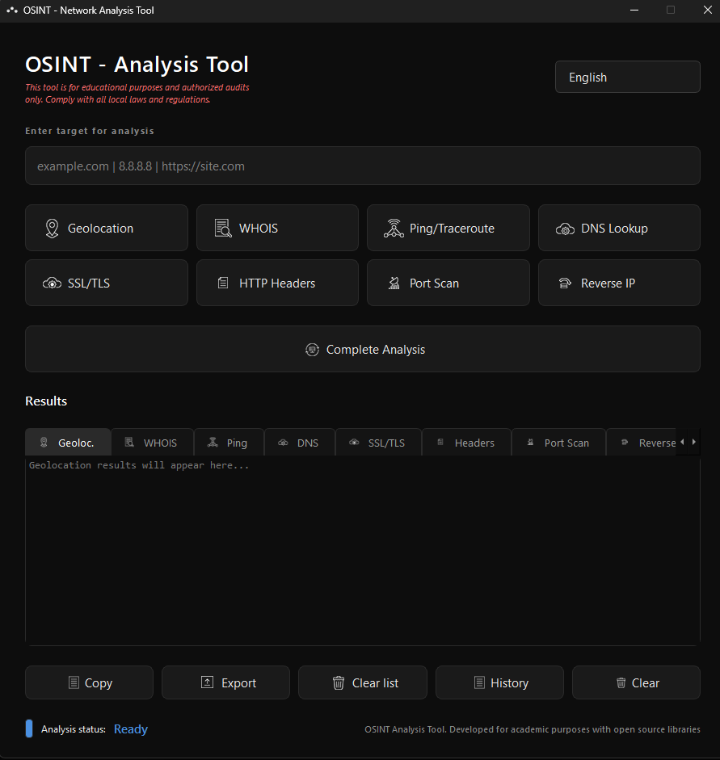
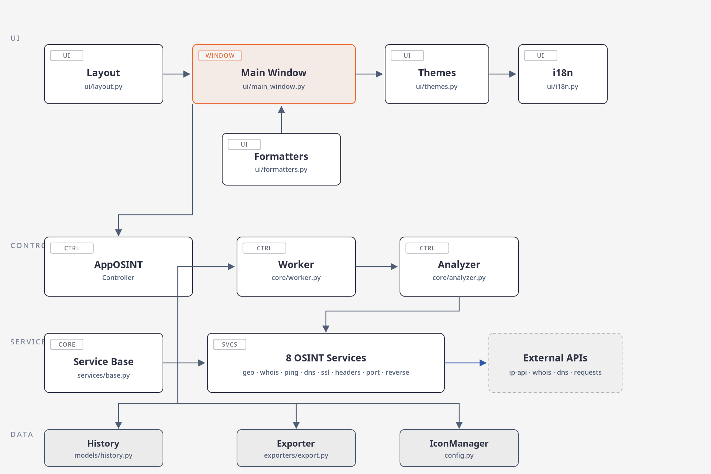

## OSINT - Analysis Tool


- [System Requirements](#system-requirements)
- [Installation](#installation)
- [User Guide](#user-guide)
- [Technical Architecture](#technical-architecture)
- [Project Structure](#project-structure)
- [Legal Notice](#legal-notice)
- [Credits](#credits)

---

**OSINT - Network Analysis Tool** is a graphical application built in **Python** with **PyQt6**, designed to perform **Open Source Intelligence (OSINT)** analysis on network targets such as:

- Domains
- IP addresses
- Web services

<div align="center">

| Screenshot                                                                        | Features:                                                                                                                                                                                                                                                                                                                                                                                                                                                     |
| --------------------------------------------------------------------------------- | :------------------------------------------------------------------------------------------------------------------------------------------------------------------------------------------------------------------------------------------------------------------------------------------------------------------------------------------------------------------------------------------------------------------------------------------------------------ |
|  | **-Geolocation**: IP and location<br><br>**-WHOIS**: Domain registration<br><br>**-Ping/Traceroute**: Basic connectivity<br><br>**-DNS Lookup**: A/MX/TXT records<br><br>**-SSL/TLS**: Certificates and security<br><br>**-HTTP Headers**: Server headers<br><br>**-Port Scan**: Common ports<br><br>**-Reverse IP**: PTR and hosts<br><br>**-Full Analysis**: Sequential execution<br><br>**-Export**: TXT/JSON/CSV<br><br>**-Clear Results**: Reset results |

</div>

The tool integrates multiple information-gathering techniques into a unified and easy-to-use interface, ideal for:

- Educational and academic purposes
- Authorized security audits
- Cybersecurity research
- Digital forensic analysis

This project is not designed for offensive use or unauthorized activities.

## System Requirements

### Minimum Software

- **Python 3.10** or higher.
- **pip** (Python package manager).
- **Operating system**: Windows or Linux.

## Installation

The application is distributed in two ways: as a self-contained **portable executable** (recommended for most users) and as **Python source code** for those who want to modify it or run it directly.

### Option 1: Portable Executable (.exe) [Recommended]

For users who only want to use the tool without setting up a Python environment, a single executable file is provided.

1.  **Download**: Get the latest version of the file `OSINT-Herramienta_de_Analisis-vX.Y.Z-windows-x64.exe` from the [Releases](https://github.com/Lanzoone30/OSINT-Herramienta-de-Analisis/releases) section of the repository.
2.  **Run**: Place the `.exe` file in your preferred folder and double-click it to launch the application. No additional installation is required.

### Option 2: Source Code and Manual Compilation

For developers or users who prefer to run the source code directly or generate their own compiled version, follow these steps.

#### Run from source code

1.  **Clone the repository** and access the directory:
    ```bash
    git clone https://github.com/Lanzoone30/OSINT-Herramienta-de-Analisis.git
    cd OSINT-Herramienta-de-Analisis
    ```
2.  **Install dependencies**:
    ```bash
    pip install -e .
    ```
3.  **Launch the application**:
    ```bash
    python main.py
    ```

#### Compile your own executable

The project includes the `compilar_app.py` script to automate the generation of the `.exe` file using PyInstaller.

1.  **Ensure build dependencies**: Install the required tools if you haven't:
    ```bash
    pip install pyinstaller pyinstaller-hooks-contrib
    ```
    Or install all dependencies at once:
    ```bash
    pip install -e .
    ```
2.  **Run the build script**:

    ```bash
    python tools/compilar_app.py
    ```

    The process will automatically perform:
    - Preparation of the working directories.
    - Copying of all necessary files.
    - Execution of PyInstaller with the required configurations.
    - Cleanup of temporary files generated during compilation.

    Alternatively, you can simply **double-click `tools/compilar_app.bat`** — it detects Python, installs PyInstaller if missing, installs the project, and launches the same build script automatically.

3.  **Find the executable**: Once finished, the file `OSINT-Herramienta_de_Analisis-vX.Y.Z-windows-x64.exe` will be ready in the `Builds/Windows/` folder (project root), alongside its `SHA256SUMS-vX.Y.Z.txt` file.

**Note**: The interface layout is built in Python (`src/osint/ui/layout.py`); it does not require `.ui` files or `pyuic6`.

## User Guide

This section describes the main features of the application's graphical interface. You can access all tools from the main button bar.

### Individual Analyses

Perform specific analyses by clicking any of the tool buttons.

|                                  Icon                                  | Name                | Description                                                                      | Example Input                                                    |
| :--------------------------------------------------------------------: | :------------------ | :------------------------------------------------------------------------------- | :--------------------------------------------------------------- |
|            | **Geolocation**     | Retrieves the approximate geographic location of an IP or domain.                | `github.com`<br>`wikipedia.org`<br>`example.com`                 |
|        | **WHOIS**           | Queries the public registration information of a domain.                         | `github.com`<br>`wikipedia.org`<br>`example.com`                 |
|          | **Ping/Traceroute** | Performs a basic ICMP connectivity test.                                         | `8.8.8.8`<br>`1.1.1.1`<br>`openai.com`                           |
|            | **DNS Lookup**      | Performs DNS queries to obtain A, MX, TXT and NS records.                        | `google.com`<br>`microsoft.com`<br>`cloudflare.com`              |
|            | **SSL/TLS**         | Analyzes the SSL/TLS certificate and security configuration of a website.        | `https://github.com`<br>`https://www.wikipedia.com`              |
|      | **HTTP Headers**    | Retrieves and analyzes the HTTP headers returned by a web server.                | `github.com`<br>`http://infobae.com`<br>`https://www.google.com` |
|  | **Port Scan**       | Scans common TCP ports to detect active services.                                | `scanme.nmap.org`<br>`192.168.1.1`<br>`localhost`                |
|    | **Reverse IP**      | Performs a reverse DNS (PTR) query to obtain the hostname associated with an IP. | `8.8.8.8`<br>`1.1.1.1`<br>`142.250.185.206`                      |

### Global Actions

These buttons control functions that affect the entire application or multiple analyses.

|                                    Icon                                    | Name              | Description                                                  | Example Use                                                                                     |
| :------------------------------------------------------------------------: | :---------------- | :----------------------------------------------------------- | :---------------------------------------------------------------------------------------------- |
|  | **Full Analysis** | Sequentially runs the 8 individual analyses above.           | Enter `github.com` and click. You will get geolocation, WHOIS, DNS, SSL, etc., in a single run. |
|          | **Export**        | Saves all analysis results to a file.                        | After analyzing `google.com`, click "Export" to save a report in TXT, JSON or CSV.              |
|            | **Clear Results** | Clears the target history and resets all results and fields. | Click to start a new analysis from scratch. You will be asked for confirmation.                 |

### Additional Interface Buttons

|                              Icon                              | Name        | Description                                                   | Example Use                                                                   |
| :------------------------------------------------------------: | :---------- | :------------------------------------------------------------ | :---------------------------------------------------------------------------- |
|  | **Copy**    | Copies all text from the active results tab to the clipboard. | Click while on the "WHOIS" tab to copy all the registration information.      |
|                              `⋮`                               | **History** | Shows a record of recent analyses in the "Summary" tab.       | Click to see a list with date, time, target and type of each recent analysis. |
|                              `×`                               | **Clear**   | Clears only the results of the active results tab.            | Click while on "Port Scan" to empty only that tab.                            |

### Accepted Input Formats

The application accepts multiple formats for each input field:

- **Simple domains**: `google.com`, `github.io`
- **IP addresses**: `192.168.1.1`, `8.8.4.4`
- **Full URLs**: `https://www.google.com`, `http://localhost:8080`
- **Subdomains**: `api.github.com`, `docs.python.org`

## Technical Architecture

The application is designed with a modular architecture that separates responsibilities, making maintenance and extension easier. The following diagram illustrates the main data flow and the interaction between components:



## Project Structure (`/src`)

```
src/osint/
├── __init__.py
├── __main__.py
├── app.py
├── config.py                 (IconManager)
├── core/
│   ├── __init__.py
│   ├── analyzer.py           (Analysis Coordinator)
│   └── worker.py             (Worker Thread)
├── exporters/
│   ├── __init__.py
│   └── export.py             (Unified Exporter: TXT/JSON/CSV)
├── models/
│   ├── __init__.py
│   └── history.py            (Analysis History)
├── services/
│   ├── __init__.py
│   ├── base.py               (Service Base Class)
│   ├── geo_service.py
│   ├── whois_service.py
│   ├── ping_service.py
│   ├── dns_service.py
│   ├── ssl_service.py
│   ├── headers_service.py
│   ├── port_service.py
│   └── reverse_service.py
└── ui/
    ├── __init__.py
    ├── i18n.py               (Translations)
    ├── formatters.py         (Result Formatters)
    ├── themes.py             (Dark Theme + QPalette)
    ├── layout.py             (Layout Builder)
    └── main_window.py        (Main Window)
```

## Legal Notice

**OSINT - Network Analysis Tool** is a tool developed for **strictly educational purposes, academic research, and authorized security audits**.

- **Acceptable Use**: The user must only employ this tool to analyze systems, domains and infrastructure for which they have **explicit, written authorization** from the owner.
- **Prohibited Use**: The use of this software to perform unauthorized analysis, violate the privacy of third parties, attack external systems, or any action that violates local or international laws is expressly prohibited.
- **Liability**: The developer assumes no responsibility for any misuse, illegal, or unauthorized use of this tool. The user is solely responsible for their actions and must ensure compliance with all applicable legislation.

## License

**Copyright (C) 2026 Adrian A. Lanzone** This project is distributed under the **MIT License**. See the LICENSE file for more details.

---

**Version**: 2.0.0 | **Last updated**: 12 August 2026
