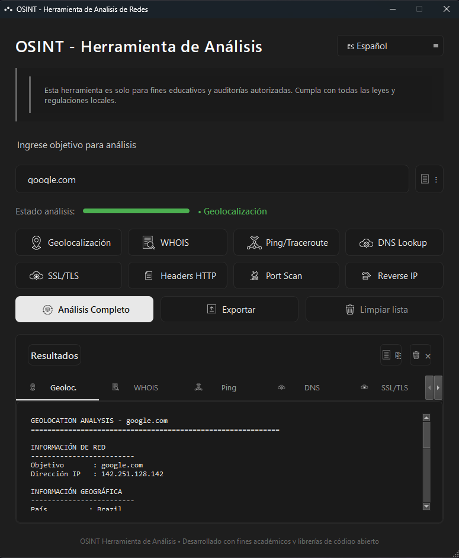
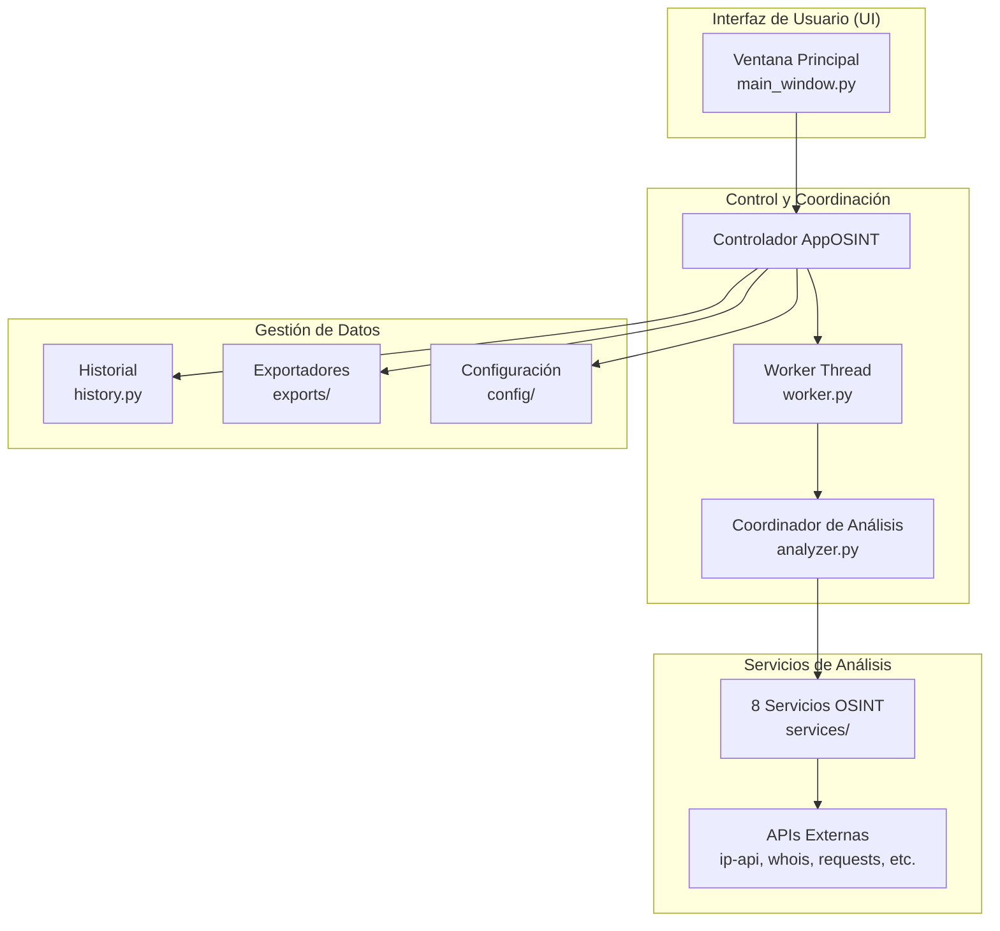

## OSINT - Herramienta de Análisis


- [Requisitos del Sistema](#requisitos-del-sistema)
- [Instalación](#instalación)
- [Guía de Uso](#guía-de-uso)
- [Arquitectura Técnica](#arquitectura-técnica)
- [Estructura del Proyecto](#estructura-del-proyecto)
- [Aviso Legal](#aviso-legal)
- [Créditos](#créditos)

---

**OSINT - Herramienta de Análisis de Redes** es una aplicación gráfica desarrollada en **Python** con **PyQt6**, diseñada para realizar análisis de **Inteligencia de Fuentes Abiertas (OSINT)** sobre objetivos de red como:

- Dominios
- Direcciones IP
- Servicios web

<div align="center">

| Captura de pantalla                                                                 | Funcionalidades:                                                                                                                                                                                                                                                                                                                                                                                                                                                                            |
| ----------------------------------------------------------------------------------- | :------------------------------------------------------------------------------------------------------------------------------------------------------------------------------------------------------------------------------------------------------------------------------------------------------------------------------------------------------------------------------------------------------------------------------------------------------------------------------------------ |
|  | **-Geolocalización**: IP y ubicación<br><br>**-WHOIS**: Registro de dominios<br><br>**-Ping/Traceroute**: Conectividad básica<br><br>**-DNS Lookup**: Registros A/MX/TXT<br><br>**-SSL/TLS**: Certificados y seguridad<br><br>**-Headers HTTP**: Cabeceras del servidor<br><br>**-Port Scan**: Puertos comunes<br><br>**-Reverse IP**: PTR y hosts<br><br>**-Análisis Completo**: Ejecución secuencial<br><br>**-Exportar**: TXT/JSON/CSV<br><br>**-Limpiar Lista**: Restablecer resultados |

</div>

La herramienta integra múltiples técnicas de recolección de información en una interfaz unificada y fácil de usar, ideal para:

- Fines educativos y académicos
- Auditorías de seguridad autorizadas
- Investigación en ciberseguridad
- Análisis forense digital

Este proyecto no está diseñado para usos ofensivos ni actividades no autorizadas.

## Requisitos del Sistema

### Software Minimo

- **Python 3.8** o superior.
- **pip** (gestor de paquetes de Python).
- **Sistema operativo**: Windows

## Instalación

La aplicación se distribuye de dos maneras: como un **ejecutable portable auto-contenido** (recomendado para la mayoría de usuarios) y como **código fuente Python** para aquellos que deseen modificarlo o ejecutarlo directamente.

### Opción 1: Ejecutable Portable (.exe) [Recomendado]

Para usuarios que solo desean utilizar la herramienta sin configurar un entorno de Python, se proporciona un único archivo ejecutable.

1.  **Descarga**: Obtén la última versión del archivo `OSINT-Herramienta de Analisis de Redes.exe` desde la sección de [Releases](https://github.com/Lanzoone30/OSINT-Herramienta-de-Analisis/releases) del repositorio.
2.  **Ejecución**: Coloca el archivo `.exe` en la carpeta de tu preferencia y haz doble clic sobre él para iniciar la aplicación. No se requiere instalación adicional.

### Opción 2: Código Fuente y Compilación Manual

Para desarrolladores o usuarios que prefieran ejecutar el código fuente directamente o generar su propia versión compilada, sigue estos pasos.

#### Ejecutar desde el código fuente

1.  **Clonar el repositorio** y acceder al directorio:
    ```bash
    git clone https://github.com/Lanzoone30/OSINT-Herramienta-de-Analisis.git
    cd OSINT-Herramienta-de-Analisis
    ```
2.  **Instalar las dependencias**:
    ```bash
    pip install -r requirements.txt
    ```
3.  **Iniciar la aplicación**:
    ```bash
    python main.py
    ```

#### Compilar tu propio ejecutable

El proyecto incluye el script `compilar_app.py` para automatizar la generación del archivo `.exe` utilizando PyInstaller.

1.  **Asegurar las dependencias de compilación**: Instala las herramientas necesarias si no lo has hecho:
    ```bash
    pip install pyinstaller pyinstaller-hooks-contrib
    ```
    O instala todas las dependencias de una vez:
    ```bash
    pip install -r requirements.txt
    ```
2.  **Ejecutar el script de compilación**:
    ```bash
    python compilar_app.py
    ```
    El proceso realizará automáticamente:
    - La preparación de los directorios de trabajo.
    - La copia de todos los archivos necesarios.
    - La ejecución de PyInstaller con las configuraciones necesarias.
    - La limpieza de archivos temporales que se generen durante la compilacion.
3.  **Encontrar el ejecutable**: Una vez finalizado, el archivo `OSINT-Herramienta de Analisis de Redes.exe` estará listo en la nueva carpeta `build_final/`.

**Nota**: Si modificás el diseño de la interfaz gráfica en el archivo `osint_app.ui`, vas a tener que regenerar nuevamente el módulo Python antes de compilar:

```bash
pyuic6 osint_app.ui -o ui/osint_window_ui.py
```

## Guía de Uso

Esta sección describe las funciones principales de la interfaz gráfica de la aplicación. Puedes acceder a todas las herramientas desde la barra principal de botones.

### Análisis Individuales

Realiza análisis específicos haciendo clic en cualquiera de los botones de herramientas.

|                                  Icono                                  | Nombre              | Descripción                                                                              | Ejemplo de Entrada                                               |
| :---------------------------------------------------------------------: | :------------------ | :--------------------------------------------------------------------------------------- | :--------------------------------------------------------------- |
|            | **Geolocalización** | Obtiene información geográfica e ISP de una dirección IP o dominio.                      | `8.8.8.8`<br>`google.com`<br>`github.com`                        |
|        | **WHOIS**           | Consulta la información de registro pública de un dominio.                               | `github.com`<br>`wikipedia.org`<br>`example.com`                 |
|          | **Ping/Traceroute** | Realiza una prueba básica de conectividad ICMP.                                          | `8.8.8.8`<br>`1.1.1.1`<br>`openai.com`                           |
|            | **DNS Lookup**      | Realiza consultas DNS para obtener registros A, MX, TXT y NS.                            | `google.com`<br>`microsoft.com`<br>`cloudflare.com`              |
|            | **SSL/TLS**         | Analiza el certificado y configuración de seguridad SSL/TLS de un sitio web.             | `https://github.com`<br>`https://www.wikipedia.com`              |
|      | **Headers HTTP**    | Recupera y analiza las cabeceras HTTP devueltas por un servidor web.                     | `github.com`<br>`http://infobae.com`<br>`https://www.google.com` |
|  | **Port Scan**       | Escanea puertos TCP comunes para detectar servicios activos.                             | `scanme.nmap.org`<br>`192.168.1.1`<br>`localhost`                |
|    | **Reverse IP**      | Realiza una consulta DNS inversa (PTR) para obtener el nombre de host asociado a una IP. | `8.8.8.8`<br>`1.1.1.1`<br>`142.250.185.206`                      |

### Acciones Globales

Estos botones controlan funciones que afectan a toda la aplicación o a múltiples análisis.

|                                    Icono                                    | Nombre                | Descripción                                                                 | Ejemplo de Uso                                                                                            |
| :-------------------------------------------------------------------------: | :-------------------- | :-------------------------------------------------------------------------- | :-------------------------------------------------------------------------------------------------------- |
|  | **Análisis Completo** | Ejecuta secuencialmente los 8 análisis individuales de arriba.              | Ingresa `github.com` y haz clic. Obtendrás geolocalización, WHOIS, DNS, SSL, etc., en una sola ejecución. |
|          | **Exportar**          | Guarda todos los resultados de los análisis en un archivo.                  | Después de analizar `google.com`, haz clic en "Exportar" para guardar un informe en TXT, JSON o CSV.      |
|            | **Limpiar Lista**     | Borra el historial de objetivos y restablece todos los resultados y campos. | Haz clic para comenzar un nuevo análisis desde cero. Se te pedirá confirmación.                           |

### Botones Adicionales de Interfaz

|                              Icono                              | Nombre        | Descripción                                                                     | Ejemplo de Uso                                                                              |
| :-------------------------------------------------------------: | :------------ | :------------------------------------------------------------------------------ | :------------------------------------------------------------------------------------------ |
|  | **Copiar**    | Copia todo el texto de la pestaña de resultados activa al portapapeles.         | Haz clic mientras estás en la pestaña "WHOIS" para copiar toda la información del registro. |
|                               `⋮`                               | **Historial** | Muestra un registro de los últimos análisis realizados en la pestaña "Resumen". | Haz clic para ver una lista con fecha, hora, objetivo y tipo de cada análisis reciente.     |
|                               `×`                               | **Limpiar**   | Borra solo los resultados de la pestaña de resultados activa.                   | Haz clic mientras estás en "Port Scan" para vaciar solo esa pestaña.                        |

### Formatos de Entrada Aceptados

La aplicación acepta múltiples formatos para cada campo de entrada:

- **Dominios simples**: `google.com`, `github.io`
- **Direcciones IP**: `192.168.1.1`, `8.8.4.4`
- **URL completas**: `https://www.google.com`, `http://localhost:8080`
- **Subdominios**: `api.github.com`, `docs.python.org`

## Arquitectura del Proyecto

La aplicación está diseñada con una arquitectura modular que separa las responsabilidades, de forma que me permite facilitar el mantenimiento y la extensión. El siguiente diagrama ilustra de forma general el flujo principal de datos y la interacción entre componentes:



## Estructura del Proyecto

```
_Archivos/Módulos_                                         _Ubicación_en_Sistema_
================================================================================
main.py                                                  Raíz del proyecto
requirements.txt                                         Raíz del proyecto
README.md                                                Raíz del proyecto
compilar_app.py                                          Raíz del proyecto
compilar_app.bat                                         Raíz del proyecto

config/i18n.py                                           /config
config/icons_manager.py                                  /config

core/analyzer.py                                         /core
core/worker.py                                           /core

exports/txt_exporter.py                                  /exports
exports/json_exporter.py                                 /exports
exports/csv_exporter.py                                  /exports

models/history.py                                        /models

services/geo_service.py                                  /services
services/whois_service.py                                /services
services/ping_service.py                                 /services
services/dns_service.py                                  /services
services/ssl_service.py                                  /services
services/headers_service.py                              /services
services/port_service.py                                 /services
services/reverse_service.py                              /services

ui/osint_app.ui                                          /ui
ui/osint_window_ui.py                                    /ui (generado)
ui/main_window.py                                        /ui

assets/icon_app.ico                                      /assets
assets/logo_osint.png                                    /assets
assets/buttons/*.ico                                     /assets/buttons
assets/tabs/*.ico                                        /assets/tabs
assets/images/*.png                                      /assets/images

```

## Aviso Legal

**OSINT - Herramienta de Análisis de Redes** es una herramienta desarrollada con **fines exclusivamente educativos, de investigación académica y para auditorías de seguridad autorizadas**.

- **Uso Aceptable**: El usuario solo debe emplear esta herramienta para analizar sistemas, dominios e infraestructuras sobre los cuales tenga **autorización explícita y por escrito** del propietario.
- **Uso Prohibido**: Queda expresamente prohibido utilizar este software para realizar actividades de análisis no autorizadas, vulnerar la privacidad de terceros, atacar sistemas ajenos o cualquier acción que infrinja leyes locales o internacionales.
- **Responsabilidad**: El desarrollador no asume ninguna responsabilidad por el uso indebido, ilegal o no autorizado que se haga de esta herramienta. El usuario es el único responsable de sus acciones y debe asegurarse de cumplir con toda la legislación aplicable.

## Licencia

**Copyright (C) 2026 Adrian A. Lanzone** Este proyecto utiliza **Licencia MIT**. Consulte el archivo LICENSE para más detalles.

---

**Versión**: 1.0.0 | **Última actualización**: 9 de Enero 2026
